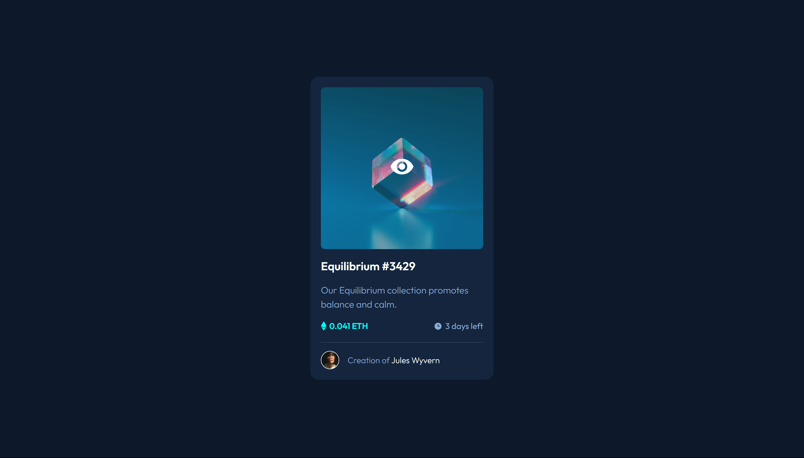

# Frontend Mentor - NFT preview card component solution

This is a solution to the [NFT preview card component challenge on Frontend Mentor](https://www.frontendmentor.io/challenges/nft-preview-card-component-SbdUL_w0U). Frontend Mentor challenges help you improve your coding skills by building realistic projects. 

## Table of contents

- [Overview](#overview)
  - [The challenge](#the-challenge)
  - [Screenshot](#screenshot)
  - [Links](#links)
- [My process](#my-process)
  - [Built with](#built-with)
  - [What I learned](#what-i-learned)
- [Author](#author)

## Overview

### The challenge

Users should be able to:

- View the optimal layout depending on their device's screen size
- See hover states for interactive elements

### Screenshot




### Links

- Solution URL: [GitHub](https://github.com/rawrisotto/nft-preview-card-component-main)
- Live Site URL: [Netlify](https://65ed7cef93097c49f8fe7f5c--keen-tanuki-63a93f.netlify.app/)

## My process

### Built with

- Semantic HTML5 markup
- CSS custom properties
- Flexbox
- Mobile-first workflow

### What I learned

- Create overlay over image
```css
.nft-img::before {
  content: url("./images/icon-view.svg");
  background: var(--clr-cyan-20);
  border-radius: 0.5rem;
  position: absolute;
  width: 286px;
  aspect-ratio: 1 / 1;
  opacity: 0;
  display: flex;
  justify-content: center;
  align-items: center;
  opacity: 0;
  transition: all 1s;
  -webkit-transition: all 1s;
}

.nft-img:hover::before {
  opacity: 1;
}
```

## Author

- GitHub - [rawrisotto](https://github.com/rawrisotto)
- Frontend Mentor - [@rawrisotto](https://www.frontendmentor.io/profile/rawrisotto)
